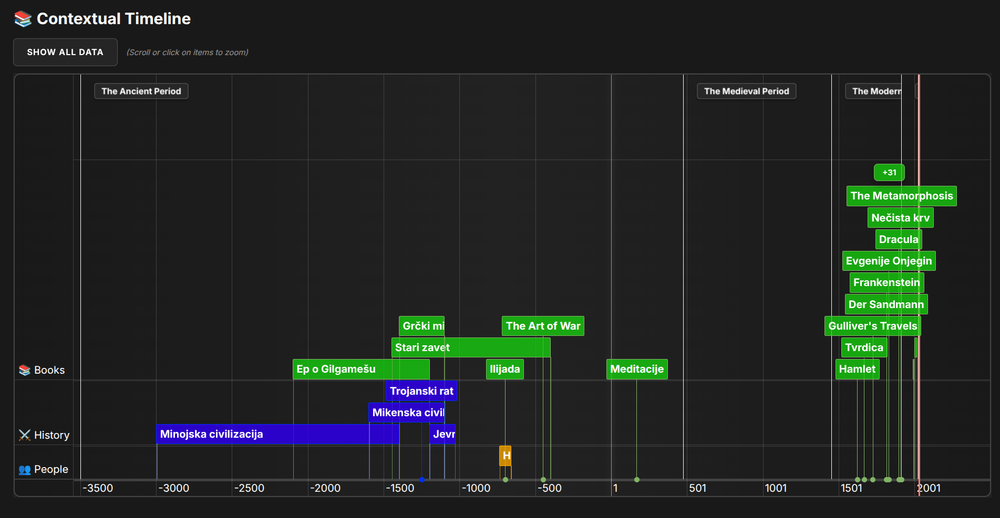

📚 Contextual Timeline
Contextual Timeline is a web tool that lets you explore books, historical events, and notable people side‑by‑side on a single, interactive time‑based map.

Built with the [vis.js library](https://visjs.org/), it provides a bird’s‑eye view of cultural and historical context, making it easy to see what happened when and together.

[🔗 Live Demo](https://kostaco.github.io/contextual-timeline/)

✨ Features
Multi‑group timeline – Books, history, and people are shown in separate horizontal tracks.

Era backgrounds – Coloured bands (e.g. Stari vek, Srednji vek) provide historical context.

Smart clustering – When too many items overlap in a group, they are automatically packed into +X bubbles to keep the view clean.

Click to zoom – Click any book, event, person, era, or cluster to zoom in smoothly.

Sticky era labels – Era names stay pinned at the top of the viewport as you scroll.

“Show All Data” – One‑click reset to the full timeline view.

Works with BC/BCE dates – Fully supports dates before year 0.

🚀 How to Use
Action	Result
Scroll (mouse wheel or trackpad)	Zooms in/out on the timeline
Drag (click and drag)	Pans left/right through time
Click any item (book, event, person)	Zooms to that item’s date range
Click an era label (e.g. Stari vek)	Zooms to that entire historical period
Click a cluster bubble (+N)	Zooms to reveal all hidden items in that cluster
Click “Show All Data”	Resets to show the entire timeline
📁 Project Structure
text
contextual-timeline/
├── index.html          # Main HTML file
├── style.css           # All styles (timeline, groups, clusters, etc.)
├── data.js             # Your data: books, eras, events, people, groups
├── script.js           # Timeline logic (clustering, zooming, labels)
├── images/             # (optional) Demo image, icon, etc.
└── README.md           # This file
🧩 How to Add Your Own Data
All data lives in data.js. You can add, remove, or modify any entry – the timeline will update automatically.

1. Add a Book
js
{ id: 101, group: "books", content: "My Novel", start: "2023-01-01", end: "2023-12-31", className: "book" }
Field	Description
id	Unique number (must not conflict with others)
group	Always "books" for this category
content	The label shown on the card
start	Start date as "YYYY-MM-DD" (BCE dates use a minus: "-000450-01-01")
end	(Optional) End date – if omitted, it’s treated as a point‑in‑time
className	Always "book" (for styling)
2. Add a Historical Event
js
{ id: 2004, group: "history", content: "My Event", start: "1945-05-08", end: "1945-09-02", className: "history" }
Field	Description
id	Unique number (use e.g. 2000–2999 to avoid collisions)
group	Always "history"
content	The label shown
start	Start date
end	(Optional) End date
className	Always "history"
3. Add a Person
js
{ id: 3001, group: "people", content: "My Person", start: "1932-01-01", end: "2017-01-01", className: "person" }
Field	Description
id	Unique number (use e.g. 3000–3999)
group	Always "people"
content	The label shown
start	Date of birth (or earliest known activity)
end	(Optional) Date of death (or latest known activity)
className	Always "person"
4. Add an Era (Background Period)
js
{ id: 1004, content: "Renaissance", start: "1400-01-01", end: "1600-01-01", className: "era", type: "background" }
Field	Description
id	Unique number (use e.g. 1000–1999)
content	Era name shown as a sticky label
start	Era start date
end	Era end date
className	Always "era"
type	Always "background"
5. Add a New Group (Track)
If you want an entirely new category (e.g. “Movies” or “Inventions”):

In data.js, add a new group to the timelineGroups array:

js
{ id: "movies", content: "🎬 Movies" }
Add your items with that group name:

js
{ id: 4001, group: "movies", content: "My Movie", start: "1999-01-01", className: "movie" }
In style.css, add styles for your new group (copy the .book, .history, or .person blocks and rename).

In script.js, add your group to the groupsData object inside updateTimelineItems() so it gets clustered:

js
let groupsData = {
  books: [],
  history: [],
  people: [],
  movies: [],        // <-- add this
  background: []
};
Then cluster it:

js
let clusteredMovies = clusterByHeight(groupsData.movies, MAX_VISIBLE_ROWS, CARD_WIDTH_PX);
And include it in the final processedItems array.

🛠 Configuration (Tuning)
You can adjust clustering behaviour inside script.js – look for these variables at the top:

Variable	Default	What it does
MAX_VISIBLE_ROWS	3	Maximum number of visible rows before items are packed into clusters. Increase to show more cards, decrease to cluster more aggressively.
CARD_WIDTH_PX	20	Approximate width of a single card (in pixels). Used to detect overlaps. Lower = more sensitive clustering.
💻 Local Development
Clone the repository:

bash
git clone https://github.com/kostaco/contextual-timeline.git
cd contextual-timeline
Open index.html directly in your browser – no build tools or server required.

For the best experience, use a local web server (e.g. VS Code’s Live Server extension) to avoid CORS issues when loading local resources.

Edit data.js to add your own content, then refresh the page.

🧠 How the Clustering Works
The timeline uses a height‑based clustering algorithm:

Each item is given a visual “footprint” based on the current zoom level.

Items are placed into rows (slots) from bottom to top.

If an item would exceed MAX_VISIBLE_ROWS, it’s moved to an “excess” list.

Excess items that appear close together on the screen are grouped into a single +N cluster bubble.

Clicking the cluster zooms in to reveal all hidden items.

This keeps the timeline readable even when many items overlap in time.

🤝 Contributing
Feel free to open issues or submit pull requests. Suggestions for new features, bug fixes, or additional data are always welcome.

📄 License
This project is open‑source and available under the MIT License.

Enjoy exploring history, one timeline at a time!
